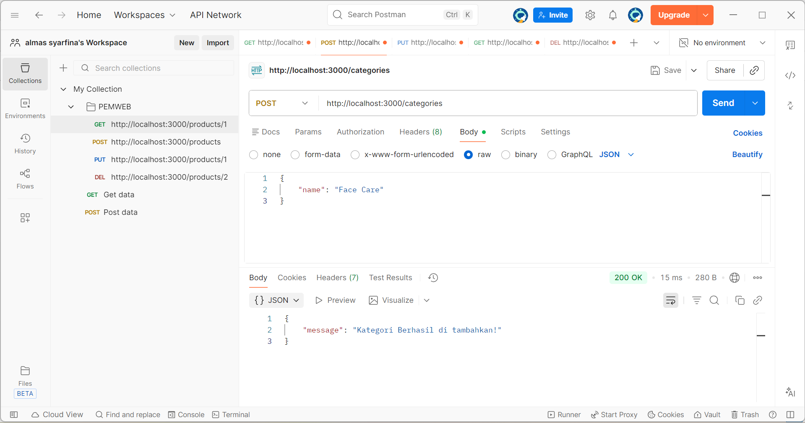
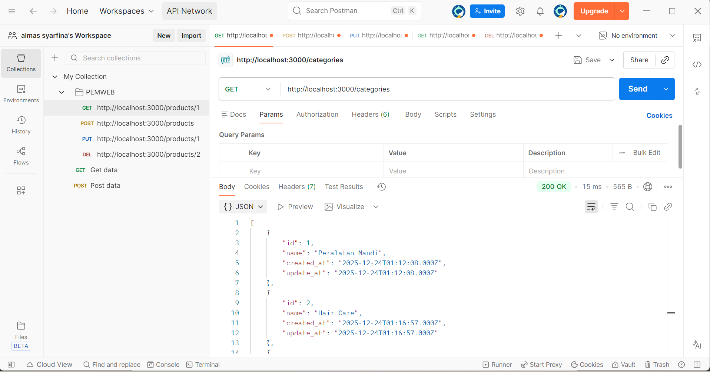
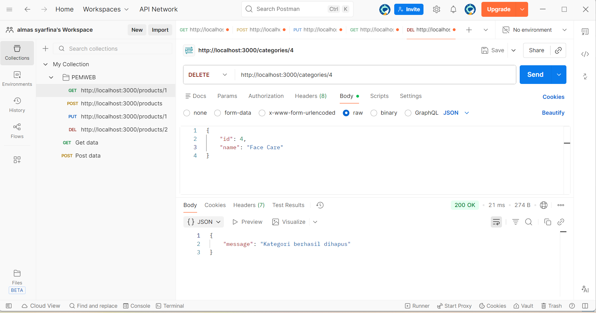
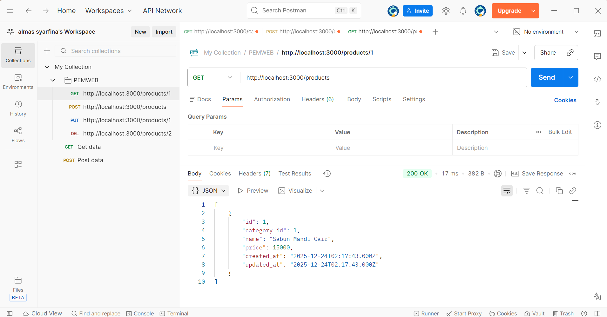
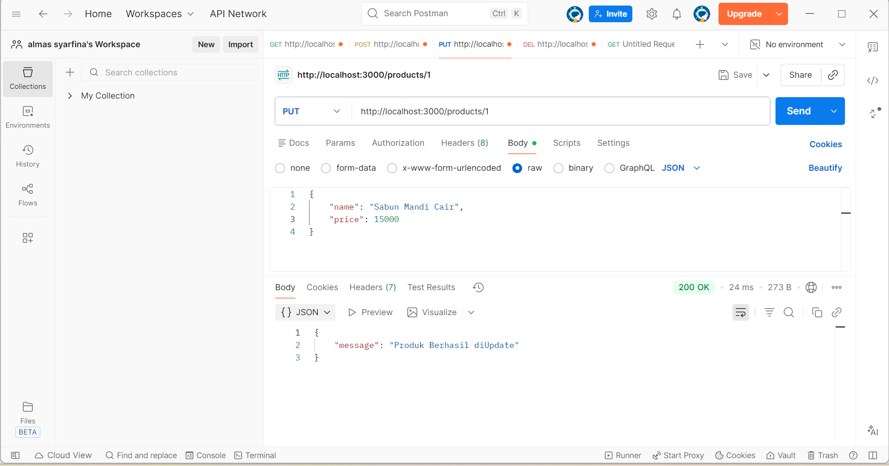
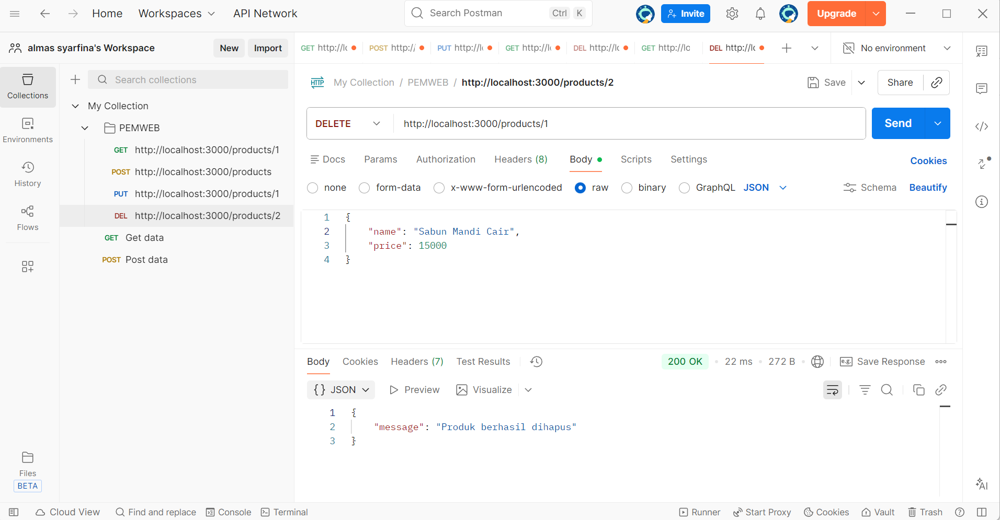

### Nama : ALMAS JAUFILAEL SYAROFINA

### NIM  : 24090092

### Kelas: 3C

# CARA MENJALANKAN PROJECT CRUD API
1. Buka Aplikasi XAMPP jalankan Apache dan MySQL
2. Akses php MyAdmin, buat database baru lalu konfigurasikan pada VS code melalui file env
3. Buka terminal pada VS Code untuk menjalankan project, lalu masukan perintah berikut : `npm run dev`
4. Buka Postman 

<H1>Categories</H1>

<H3>Create Kategori<H3>
  1. Pilih metode Post

  2. Masukkan URL `http://localhost:3000/categories`

  3. Klik body, lalu pilih raw dan masukkan data JSON
     `{
     "name" : "Face Care"
     }`

<H3>Read Kategori</H3>
 1. Pilih metode GET
 
 2. Masukkan URL
   `http://localhost:3000/categories`

3. klik send, data akan di tampilkan

<H3>Update Kategori<H3>
  

<H3>Delete Kategori<H3>
  

<H1>Products</H1>

<H3>Create Produk<H3>
  

<H3>Read Produk<H3>

<H3>Update Produk<H3>

<H3>Delete Produk<H3>

